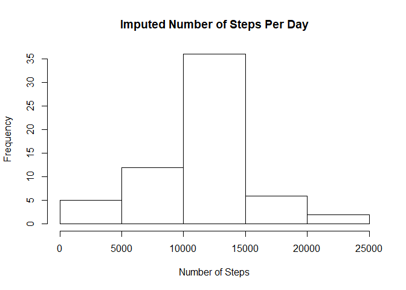

# Reproducible Research: Peer Assessment 1

Assignment
========================================================

This assignment will be described in multiple parts. You will need to write a report that answers the questions detailed below. Ultimately, you will need to complete the entire assignment in a single R markdown document that can be processed by knitr and be transformed into an HTML file.

Throughout your report make sure you always include the code that you used to generate the output you present. When writing code chunks in the R markdown document, always use echo = TRUE so that someone else will be able to read the code. This assignment will be evaluated via peer assessment so it is essential that your peer evaluators be able to review the code for your analysis.

For the plotting aspects of this assignment, feel free to use any plotting system in R (i.e., base, lattice, ggplot2)

Fork/clone the GitHub repository created for this assignment. You will submit this assignment by pushing your completed files into your forked repository on GitHub. The assignment submission will consist of the URL to your GitHub repository and the SHA-1 commit ID for your repository state.

NOTE: The GitHub repository also contains the dataset for the assignment so you do not have to download the data separately.


## Loading and preprocessing the data
Unzip the folder and read in the data in the activity.csv file.

```r
if (!file.exists('activity.csv')) {
  unzip(zipfile = "activity.zip")
}

activityData <- read.csv(file="activity.csv", header=TRUE)
```


## What is mean total number of steps taken per day?

```r
# Calculate the total steps taken per day
totalSteps <- aggregate(steps ~ date, activityData, FUN=sum)

# Make a histogram of the total number of steps taken per day
hist(totalSteps$steps,
     main = "Total Steps per Day",
     xlab = "Number of Steps")
```

<!-- -->

```r
# Calculate and report the mean and median of total steps taken per day
meanSteps <- mean(totalSteps$steps, na.rm = TRUE)
medSteps <- median(totalSteps$steps, na.rm = TRUE)
```

<center>Mean Number of Steps Taken per Day = 1.0766189\times 10^{4}</center>
<center>Median Number of Steps Taken per Day = 10765</center>

## What is the average daily activity pattern?

```r
# Make a time-series plot of the 5-minute interval and the average number of
# steps taken, averaged acoss all days.
library(ggplot2)
meanStepsByInt <- aggregate(steps ~ interval, activityData, mean)
ggplot(data = meanStepsByInt, aes(x = interval, y = steps)) +
  geom_line() +
  ggtitle("Average Daily Activity Pattern") +
  xlab("5-minute Interval") +
  ylab("Average Number of Steps") +
  theme(plot.title = element_text(hjust = 0.5))
```

<!-- -->

```r
# Which 5-minute interval across all days contain the maximum number of steps
maxInt <- meanStepsByInt[which.max(meanStepsByInt$steps),]
```

## Imputing Missing Values

```r
# Calculate and report the total number of missing values in the dataset
missingVals <- is.na(activityData$steps)

# Devise a strategy for filling in all of the missing values
```

There are 17568 missing values. I will replace these missing values with the 5-day average of that respective interval.


```r
# Create a new dataset that is equal to the original dataset but with 
# the missing data filled in.
imp_activityData <- transform(activityData,
                              steps = ifelse(is.na(activityData$steps),
                                             meanStepsByInt$steps[match(activityData$interval, 
                                                                        meanStepsByInt$interval)],
                                             activityData$steps))

# Make a histogram of the total number of steps taken each day and
# and report the mean and median.
impStepsByInt <- aggregate(steps ~ date, imp_activityData, FUN=sum)
hist(impStepsByInt$steps,
     main = "Imputed Number of Steps Per Day",
     xlab = "Number of Steps")
```

<!-- -->

```r
impMeanSteps <- mean(impStepsByInt$steps, na.rm = TRUE)
impMedSteps <- median(impStepsByInt$steps, na.rm = TRUE)
diffMean = impMeanSteps - meanSteps
diffMed = impMedSteps - medSteps
diffTotal = sum(impStepsByInt$steps) - sum(totalSteps$steps)
```

There is a difference of 0 in the mean steps of the two dataset.
There is a difference of -1.0763811\times 10^{4} in the median steps of the two dataset.
There is a difference of 8.6129509\times 10^{4} in the total steps of the two dataset.

## Are there differences in activity patterns between weekdays and weekends?

```r
# Create a new factor variable in the dataset with two levels - "weekend" and "weekday"
DayType <- function(date) {
  day <- weekdays(date)
  if (day %in% c('Monday', 'Tuesday', 'Wednesday', 'Thursday', 'Friday'))
      return ("weekeday")
  else if (day %in% c('Saturday', 'Sunday'))
      return ("weekend")
  else
      stop ("Invalid Date Format.")
}
imp_activityData$date <- as.Date(imp_activityData$date)
imp_activityData$day <- sapply(imp_activityData$date, FUN = DayType)

# Make a panel plot containnig a time-series plot of the 5-minute interval
# and the average number of steps taken across all weekdays or weekends
meanStepsByDay <- aggregate(steps ~ interval + day, imp_activityData, mean)
ggplot(data = meanStepsByDay, aes(x = interval, y = steps)) + 
  geom_line() +
  facet_grid(day ~ .) +
  ggtitle("Average Daily Activity Pattern") +
  xlab("5-minute Interval") +
  ylab("Average Number of Steps") +
  theme(plot.title = element_text(hjust = 0.5))
```

<!-- -->
